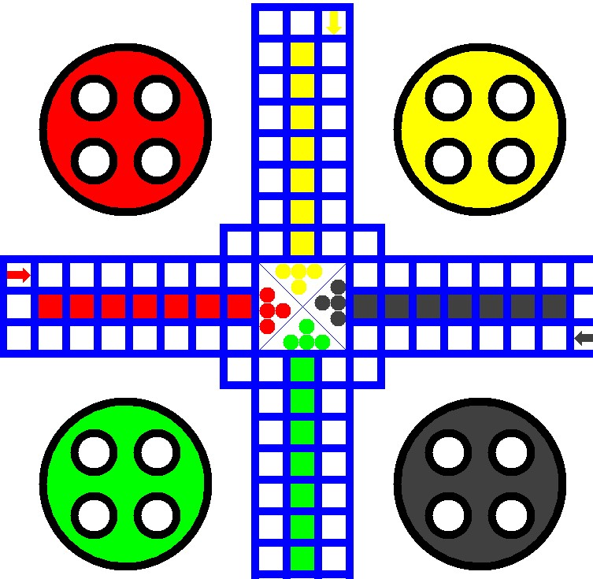

Projeto criado por mim e os Washington, Wesley e Vanessa durante as aulas de matemática para computação gráfica com a professora Silvana, no curso de programação de jogos digitais na Etec Guaracy Silveira extensão Godofredo Furtado durante o segundo semestre de 2015.

Arquivos do projeto
Ludo_2.java é a versão original do código levemente alterado para funcionar (linha 168, alterado a posição dos *[]*, para depois de *args* e removido a linha 1 *package trabalhos;*)
Ludo.docx é o documento entregue á professora Silvana, com o código do projeto (foi ela que pediu o projeto impresso ¯\_(ツ)_/¯)
resultado_final.jpg é a screenshot do resultado final do código

Resultado final:
